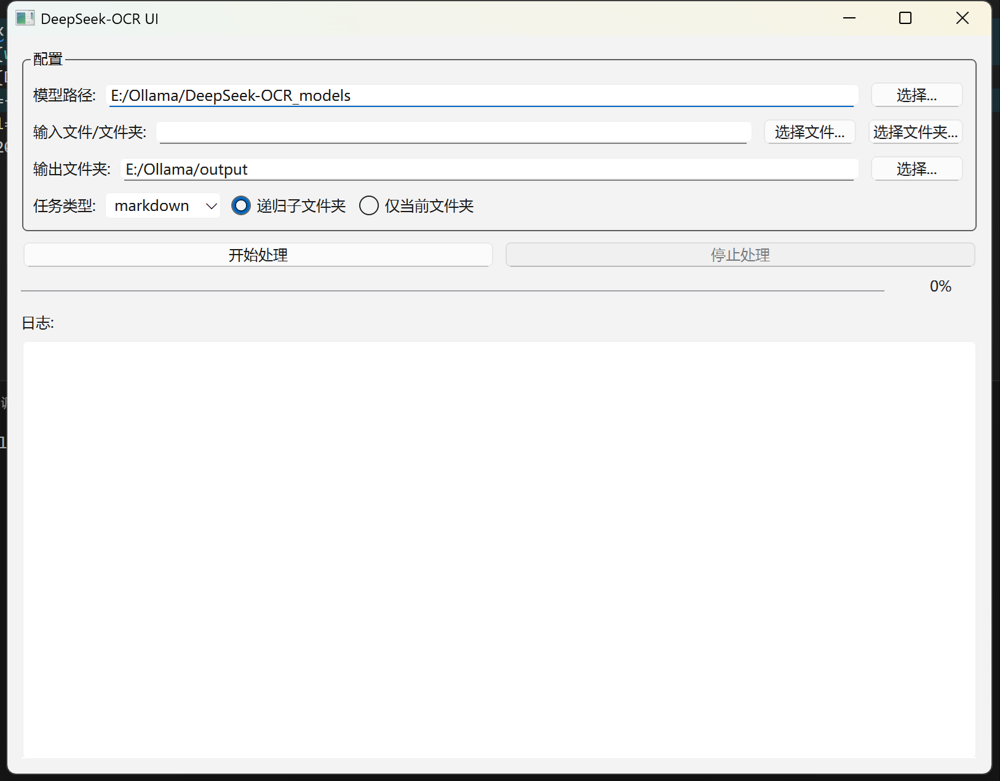

<!-- markdownlint-disable first-line-h1 -->
<!-- markdownlint-disable html -->
<!-- markdownlint-disable no-duplicate-header -->


<div align="center">
  
</div>


<hr>
<div align="center">
  <a href="https://www.deepseek.com/" target="_blank">
    
  </a>
  <a href="https://huggingface.co/deepseek-ai/DeepSeek-OCR" target="_blank">
    
  </a>

</div>

<div align="center">

  <a href="https://discord.gg/Tc7c45Zzu5" target="_blank">
    
  </a>
  <a href="https://twitter.com/deepseek_ai" target="_blank">
    
  </a>

</div>


<p align="center">
  <a href="https://huggingface.co/deepseek-ai/DeepSeek-OCR"><b>📥 Model Download</b></a> |
  <a href="https://github.com/deepseek-ai/DeepSeek-OCR/blob/main/DeepSeek_OCR_paper.pdf"><b>📄 Paper Link</b></a> |
  <a href="https://arxiv.org/abs/2510.18234"><b>📄 Arxiv Paper Link</b></a> |
</p>

<h2>
<p align="center">
  <a href="">DeepSeek-OCR: Contexts Optical Compression</a>
</p>
</h2>

<p align="center">

</p>
<p align="center">
<a href="">Explore the boundaries of visual-text compression.</a>       
</p>

## Release
- [2025/10/20]🚀🚀🚀 We release DeepSeek-OCR, a model to investigate the role of vision encoders from an LLM-centric viewpoint.

## Contents
- [Release](#release)
- [Contents](#contents)
- [Install](#install)
- [vLLM-Inference](#vllm-inference)
- [Transformers-Inference](#transformers-inference)
- [Support-Modes](#support-modes)
- [Prompts examples](#prompts-examples)
- [Visualizations](#visualizations)
- [UI Demo](#ui-demo)
- [Acknowledgement](#acknowledgement)
- [Citation](#citation)


## Install
>Our environment is cuda11.8+torch2.6.0.
1. Clone this repository and navigate to the DeepSeek-OCR folder
```bash
git clone https://github.com/deepseek-ai/DeepSeek-OCR.git
```
2. Conda
```Shell
conda create -n deepseek-ocr python=3.12.9 -y
conda activate deepseek-ocr
```
3. Packages

- download the vllm-0.8.5 [whl](https://github.com/vllm-project/vllm/releases/tag/v0.8.5) 
```Shell
pip install torch==2.6.0 torchvision==0.21.0 torchaudio==2.6.0 --index-url https://download.pytorch.org/whl/cu118
# pip install vllm-0.8.5+cu118-cp38-abi3-manylinux1_x86_64.whl
pip install vllm-0.8.5+cu118-cp312-cp312-manylinux_x86_64.whl
pip install -r requirements.txt
pip install flash-attn==2.7.3 --no-build-isolation
```
**Note:** if you want vLLM and transformers codes to run in the same environment, you don't need to worry about this installation error like: vllm 0.8.5+cu118 requires transformers>=4.51.1

## vLLM-Inference
- VLLM:
>**Note:** change the INPUT_PATH/OUTPUT_PATH and other settings in the DeepSeek-OCR-master/DeepSeek-OCR-vllm/config.py
```Shell
cd DeepSeek-OCR-master/DeepSeek-OCR-vllm
```
1. image: streaming output
```Shell
python run_dpsk_ocr_image.py
```
2. pdf: concurrency ~2500tokens/s(an A100-40G)
```Shell
python run_dpsk_ocr_pdf.py
```
3. batch eval for benchmarks
```Shell
python run_dpsk_ocr_eval_batch.py
```
## Transformers-Inference
- Transformers
```python
from transformers import AutoModel, AutoTokenizer
import torch
import os
os.environ["CUDA_VISIBLE_DEVICES"] = '0'
model_name = 'deepseek-ai/DeepSeek-OCR'

tokenizer = AutoTokenizer.from_pretrained(model_name, trust_remote_code=True)
model = AutoModel.from_pretrained(model_name, _attn_implementation='flash_attention_2', trust_remote_code=True, use_safetensors=True)
model = model.eval().cuda().to(torch.bfloat16)

# prompt = "<image>\nFree OCR. "
prompt = "<image>\n<|grounding|>Convert the document to markdown. "
image_file = 'your_image.jpg'
output_path = 'your/output/dir'

res = model.infer(tokenizer, prompt=prompt, image_file=image_file, output_path = output_path, base_size = 1024, image_size = 640, crop_mode=True, save_results = True, test_compress = True)
```
or you can
```Shell
cd DeepSeek-OCR-master/DeepSeek-OCR-hf
python run_dpsk_ocr.py
```
## Support-Modes
The current open-source model supports the following modes:
- Native resolution:
  - Tiny: 512×512 （64 vision tokens）✅
  - Small: 640×640 （100 vision tokens）✅
  - Base: 1024×1024 （256 vision tokens）✅
  - Large: 1280×1280 （400 vision tokens）✅
- Dynamic resolution
  - Gundam: n×640×640 + 1×1024×1024 ✅

## Prompts examples
```python
# document: <image>\n<|grounding|>Convert the document to markdown.
# other image: <image>\n<|grounding|>OCR this image.
# without layouts: <image>\nFree OCR.
# figures in document: <image>\nParse the figure.
# general: <image>\nDescribe this image in detail.
# rec: <image>\nLocate <|ref|>xxxx<|/ref|> in the image.
# '先天下之忧而忧'
```


## Visualizations
<table>
<tr>
<td></td>
<td></td>
</tr>
<tr>
<td></td>
<td></td>
</tr>
</table>

## UI Demo
我们提供了一个基于 Python Qt6 的交互式桌面 UI 界面，方便用户上传图片或 PDF 文件并进行 OCR 识别。

**主要功能:**
*   **模型加载**: 允许用户指定 DeepSeek-OCR 模型的本地路径。
*   **输入选择**: 支持选择单个图片文件 (.png, .jpg, .jpeg, .bmp) 或 PDF 文件，也可以选择包含多个文件或子文件夹的目录。
*   **输出设置**: 用户可以指定 OCR 结果的输出文件夹。
*   **任务模式**: 提供 'markdown' (将文档转换为 Markdown 格式) 和 'ocr' (自由文本 OCR) 两种任务模式。
*   **递归处理**: 对于选择的文件夹，可以选择是否递归处理其所有子文件夹中的文件。
*   **进度与日志**: 实时显示处理进度和详细操作日志。
*   **多线程**: OCR 任务在独立线程中运行，确保 UI 响应流畅。
*   **中断任务**: 用户可以随时停止正在进行的 OCR 任务。

**如何运行 UI:**
1.  确保您已安装所有依赖项 (参见 [Install](#install) 部分)。
2.  导航到 DeepSeek-OCR-master/DeepSeek-OCR-hf 目录:
    ```bash
    cd DeepSeek-OCR-master/DeepSeek-OCR-hf
    ```
3.  运行 UI 应用程序:
    ```bash
    python DeepSeek-OCR_ui.py
    ```

<p align="center">

</p>

## Acknowledgement

We would like to thank [Vary](https://github.com/Ucas-HaoranWei/Vary/), [GOT-OCR2.0](https://github.com/Ucas-HaoranWei/GOT-OCR2.0/), [MinerU](https://github.com/opendatalab/MinerU), [PaddleOCR](https://github.com/PaddlePaddle/PaddleOCR), [OneChart](https://github.com/LingyvKong/OneChart), [Slow Perception](https://github.com/Ucas-HaoranWei/Slow-Perception) for their valuable models and ideas.

We also appreciate the benchmarks: [Fox](https://github.com/ucaslcl/Fox), [OminiDocBench](https://github.com/opendatalab/OmniDocBench).

## Citation

```bibtex
@article{wei2024deepseek-ocr,
  title={DeepSeek-OCR: Contexts Optical Compression},
  author={Wei, Haoran and Sun, Yaofeng and Li, Yukun},
  journal={arXiv preprint arXiv:2510.18234},
  year={2025}
}
